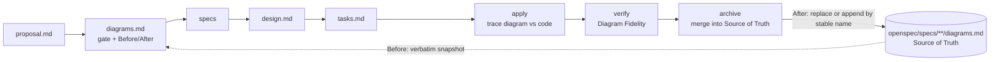

# VSDD Kit — Visual Spec-Driven Development for OpenSpec

**Architecture diagrams that stay true to the code.** VSDD extends
[OpenSpec](https://github.com/Fission-AI/OpenSpec) so that every change records a
**Before/After Mermaid diagram**, has it checked against the code, and on archive
**merges it into a canonical diagram Source of Truth**. Diagrams get the same delta
discipline as specs.

**Why bother?** See [The Case for VSDD](docs/WHY_VSDD.md): the problem, the benefits,
the costs, objections, and how to tell whether it's working.

The kit is designed to be **installed by your AI coding agent**. Point Claude Code,
OpenCode, Qwen Code, Codex, Cursor or similar at [`SETUP.md`](SETUP.md), and it
installs, configures, seeds and verifies everything.

---

## Why

| Problem | What VSDD does |
|---|---|
| **Diagram drift**: diagrams are stale as soon as code changes | Diagrams change in the same change as the code, and merge on archive |
| Text specs hide structural impact | Reviewers see the Before and After states side by side |
| Agents forget architectural constraints over a long session | The agent must model the change visually before it writes requirements and tasks |
| No record of why the architecture changed | The archive keeps each Before/After pair plus a **Deviations** note (planned vs built) |

## How it works



1. **Gate.** Every change's `diagrams.md` starts with `## Diagram needed?`. Bug fixes
   are usually a one-line `NO`. The answer is `YES` when navigation, a state machine,
   data flow, topology or a schema changes.
2. **Placement and Before/After.** A `## Placement` table names each diagram the change
   touches, which Source of Truth file it lives in, and the action: `update`, `add`,
   `move from <file>` or `remove`. Diagrams live with the capability they describe:
   adding one to the cross-cutting architecture file needs a `Why here` reason, and
   the validator warns when a new capability's flow lands there. The Before state is
   copied **verbatim** from that file, which the validator checks. The After state proposes the change under the
   **same stable section names**.
3. **Diagrams checked against the code.** During apply and verify, the agent confirms
   that every node and edge in the After state exists in the code. Where they differ,
   it corrects the diagram and records the difference in a `## Deviations` section.
4. **Merge on archive.** Each Placement row is applied: sections are replaced,
   appended, moved between files (for example into a new capability's own
   `diagrams.md`) or removed. Nothing without a row is touched.
5. **Lessons kept.** When a fix reveals a pattern that could recur, the archive step
   proposes a rule for `openspec/specs/architecture/decisions.md`. Later designs read
   that log first, so the same mistake isn't repeated in another capability.

A change's `diagrams.md`:

````markdown
## Diagram needed?

YES - adds a discount-code step to the checkout flow

## Placement

| Stable name | Source of Truth file | Action |
|---|---|---|
| Checkout Flow | specs/checkout/diagrams.md | update |
| Discount Validation | specs/checkout/diagrams.md | add |

## Before State

### Checkout Flow
<verbatim copy from the Source of Truth>

## After State

### Checkout Flow
<updated diagram>

### Discount Validation
<new diagram - appended on archive>

## Deviations
- **Proposed:** the app validates discount codes locally. **Built:** validation
  calls the pricing API. **Why:** discount rules change without an app release (design D2).
````

## Quick start

**Requirements:** [OpenSpec CLI](https://github.com/Fission-AI/OpenSpec) ≥ 1.2.0 and
Python ≥ 3.9. Optional: [mermaid-cli](https://github.com/mermaid-js/mermaid-cli) (`mmdc`),
for render checks.

```bash
npm install -g @fission-ai/openspec
git clone <this-repo> ~/vsdd-kit
```

Then open your project in your AI coding tool and say:

> Follow `~/vsdd-kit/SETUP.md` to install VSDD into this project.

The agent works through 10 steps (0 to 9). Each step ends with a verification
command. It only asks you about decisions that are yours: which AI tools you use,
config changes, CI, and removing existing rules. At the end it reports what it
installed.

The mechanical Steps 0–5 are done by one script, `files/scripts/vsdd/vsdd_install.py`,
in a few seconds, so the agent's time goes on the judgement steps: describing your
project in `config.yaml`, and drawing the baseline diagrams from your code. This
matters most with slower local models. The script stops and names a flag whenever a
decision is yours, and changes nothing until you've answered. You can also run it
yourself:

```bash
python3 ~/vsdd-kit/files/scripts/vsdd/vsdd_install.py --root . --tools claude --dry-run
```

| Step | What happens |
|---|---|
| 0 Preflight | Checks git, OpenSpec, Python and mmdc. Detects AI tools and any earlier or hand-edited install |
| 1 OpenSpec | `openspec init` / `update`, backing up hand-edited skills first |
| 2 Files | Installs the schema, docs and scripts |
| 3 Config | `openspec/config.yaml`, with `context` written from your actual project |
| 4 Agent files | Adds a routing section to `AGENTS.md` (and `CLAUDE.md` for Claude Code). If you already have an `AGENTS.md`, you choose: the section, a one-line pointer, or leave it alone |
| 5 Overlay | Adds the VSDD steps to the OpenSpec skills and wraps the `/opsx` commands |
| 6 Baseline | Seeds `openspec/specs/architecture/diagrams.md` from your real code |
| 7 CI | Optional GitHub Actions workflow |
| 8 Smoke test | Validates a sample change, breaks it on purpose, and cleans up |
| 9 Report | Summary, decisions made, and anything needing your attention |

## Day-to-day use

```text
/opsx:propose add offline caching to the file list   # proposal → diagrams → specs → design → tasks
#   review diagrams.md: gate, Before copied verbatim, After shows the intended change
/opsx:apply                                          # implement, then check the diagram against the code
/opsx:verify                                         # includes a Diagram Fidelity check
/opsx:archive                                        # syncs specs AND merges diagrams into the Source of Truth
```

Command names vary by tool (`/opsx:apply` in Claude Code, `/opsx-apply` in OpenCode
and Qwen).

```bash
python3 scripts/vsdd/validate_mermaid.py            # lint + change structure
python3 scripts/vsdd/validate_mermaid.py --render   # also render with mermaid-cli
python3 scripts/vsdd/merge_diagrams.py openspec/changes/<name> --dry-run   # preview the archive merge
python3 scripts/vsdd/install_overlay.py             # re-apply after `openspec update`
python3 scripts/vsdd/install_overlay.py --check     # CI: fail if the overlay was wiped
```

## What gets installed

| In your project | Purpose |
|---|---|
| `openspec/schemas/visual-driven/` | Schema and templates: `proposal → diagrams → specs → design → tasks` |
| `openspec/config.yaml` | `schema: visual-driven`, your project `context`, and per-artifact `rules` |
| `openspec/specs/**/diagrams.md` | The **Source of Truth**: one `## <Stable Name>` section per diagram |
| `docs/VSDD.md` | Standards for agents: gate, Before/After, Deviations, merge |
| `docs/MERMAID_RULES.md` | Syntax guardrails that keep LLM-written diagrams parseable |
| `AGENTS.md` section / `CLAUDE.md` | A short section that sends agents to the detailed docs only when they need them |
| `.<tool>/skills/openspec-*` | Stock OpenSpec skills with the VSDD steps inserted, each marked `<!-- vsdd:… -->` |
| `openspec/config.yaml` `operations` | The key VSDD steps, repeated as CLI guidance (newer OpenSpec) |
| `.<tool>/command*/opsx-*` | Thin wrappers that load those skills |
| `scripts/vsdd/` | `validate_mermaid.py` (lint, structure, verbatim Before), `merge_diagrams.py` (the archive merge, deterministic), `install_overlay.py`, `openspec_preflight.py` (what `openspec update` would delete, tools to add), `vsdd_snapshot.py` (saves and restores what git can't). The installer, `vsdd_install.py`, runs from the kit and isn't copied |
| `.github/workflows/vsdd.yml` | CI: render every diagram and check the overlay (optional) |

## Design notes

**Overlay, not forked skills.** `openspec init` and `openspec update` regenerate the
stock skills and commands for every tool and silently overwrite any edits.
`install_overlay.py` inserts marked VSDD blocks at stable anchor lines in whatever
skills OpenSpec generated, for any tool. Re-running it changes nothing that is already
in place, and `--check` reports whether it is applied.

**Commands become wrappers.** Stock `/opsx` commands carry their **own copy** of the
skill instructions. Without wrapping, typing `/opsx:archive` would skip the diagram
merge.

**Only known config keys are read.** OpenSpec reads `context:` and `rules:` from
`config.yaml` (newer versions also read `operations:`), and ignores any other key
(such as `prompts:`) without warning. The example config and Step 3 of the runbook
take care of this.

**A second channel for the key steps.** On newer OpenSpec, the example config also
states the check against the code and the archive merge as `operations.apply` and
`operations.archive` guidance. The CLI hands that guidance to the *stock* skills, so
those steps still happen even if an `openspec update` has wiped the overlay.

**The rule that matters most is also in the schema.** The rule that the diagram must
be checked against the code is in `schema.yaml` (`apply.instruction`), so the CLI
delivers it even if the overlay is missing.

**Mermaid guardrails.** LLMs often produce Mermaid that won't parse. The rules require
quoted node labels, explicit `activate`/`deactivate`, a declared flowchart direction
and no semicolons. Sequence-diagram participant names must **not** be quoted, because
the quotes show up in the rendered output. The validator enforces all of these, and
`--render` catches everything else.

## Keeping it working

| When | Do |
|---|---|
| Before `openspec update` | `python3 scripts/vsdd/openspec_preflight.py`. If it would delete workflows, use `--safe-update` or add them to your profile |
| After `openspec init` / `openspec update` | `python3 scripts/vsdd/install_overlay.py` |
| After upgrading OpenSpec | Run `tests/smoke_test.sh` in this repo. On `anchor not found`, update the anchors in `install_overlay.py` |
| When adding an AI tool | `openspec init --tools <tool>`, then the overlay |

> **Caution:** `openspec update` also **removes** skills for workflows missing from
> your global OpenSpec profile (`openspec config list`). `openspec_preflight.py`
> tells you exactly which ones, and `--safe-update` updates without deleting them.
> The lasting fix is adding every workflow you use with `openspec config profile`.

**Every install is reversible.** The agent works on a `vsdd-install` branch, and
first saves a snapshot, outside the project, of what git can't restore: gitignored
tool folders, untracked `/opsx` commands, your global OpenSpec config and the CLI
version. Rolling back means switching branch, then running
`vsdd_snapshot.py restore`. See "Roll back an install" in `SETUP.md`.

**Workspaces that share one folder of `/opsx` commands** (VS Code multi-root, Devin)
are supported: the preflight finds the shared folder, the installer asks before
patching it, and a guard keeps the VSDD steps inactive in projects without VSDD.
With `--tooling-dir`, the kit's docs and scripts stay outside the project (for example
in the kit clone, added to the workspace), and the project only gets the schema, its
config entries and its own diagrams.

**Installing into a project that already uses OpenSpec** is supported. The runbook
runs the preflight first. It keeps your specs, changes and `config.yaml` entries,
asks before replacing a custom schema, never deletes workflows without asking, and
adds any new tools with `openspec init --tools`, which leaves the rest alone.
Changes already in flight keep their original schema, so they get no diagram
merge.

## Testing the kit

```bash
tests/smoke_test.sh                     # tools: claude,opencode,qwen
TOOLS=claude tests/smoke_test.sh        # a single tool
KEEP=1 tests/smoke_test.sh              # keep the temp project for inspection
GLOBAL_PROFILE=1 tests/smoke_test.sh    # use your own OpenSpec workflow profile
```

The test builds a throwaway project, runs the `SETUP.md` steps against your installed
OpenSpec, and checks every Verify condition:

- schema validity, and `context`/`rules` injection
- the `operations` backstop, when the CLI supports `instructions archive`
- overlay apply, idempotency, command wrapping, and every patched skill for each tool
- diagram validation, including deliberately broken cases: bad Mermaid, a missing or
  inconsistent Placement table, a Before copy that isn't verbatim, and a new
  capability's flow added to the architecture file without a reason
- the archive merge: update, add, move and remove, idempotency, and refusing to merge
  when the Source of Truth changed after the change was proposed
- an **existing OpenSpec** project with a reduced global profile:
  - the preflight predicts the deletions, the tool to add, the custom schema, and
    an in-flight change;
  - `--safe-update` keeps every workflow;
  - `init --tools` adds a tool without touching the setup;
  - a plain `update` deletes exactly what was predicted.
- **rollback:** branch, snapshot, install (committed, and changing the global config),
  then switch back and restore. The working tree and global config come back
  byte-identical.
- recovery after `openspec update`

By default it uses an isolated OpenSpec config with **every workflow enabled**, so the
result doesn't depend on your machine's profile, and all overlay patches are exercised.
Run it after changing the kit and after every OpenSpec upgrade. An `anchor not found`
from the overlay means the stock skill text changed, so update the `PATCHES` anchors
in `install_overlay.py`.

## Repository layout

```
vsdd-kit/
├── README.md                    ← this file
├── SETUP.md                     ← runbook for the AI agent
├── docs/WHY_VSDD.md             ← the case for adopting VSDD
├── docs/ARCHITECTURE.md         ← for contributors: how the scripts fit together
├── docs/concept-report.md       ← background: the research and concept behind VSDD
├── tests/smoke_test.sh          ← end-to-end test
└── files/                       ← mirrors the target project layout
    ├── openspec/                ← schema, templates, config example, Source of Truth skeleton
    ├── docs/                    ← VSDD.md, MERMAID_RULES.md
    ├── agents/                  ← AGENTS.md section, CLAUDE.md example
    ├── scripts/vsdd/            ← install_overlay.py, validate_mermaid.py, merge_diagrams.py, openspec_preflight.py, vsdd_snapshot.py
    └── ci/github/vsdd.yml       ← GitHub Actions workflow
```

## Compatibility

VSDD works with any tool OpenSpec supports, because it builds on the skills and
commands OpenSpec generates for that tool. With OpenSpec 1.13.2, all **40** tools
were checked by running `openspec init --tools <tool>` for each one, then the kit:

| Level | Tools |
|---|---|
| **Used end to end** (install → propose → apply → verify → archive) | Claude Code |
| **Overlay applied, `--check` passes, commands wrapped, run in `smoke_test.sh`** | Claude Code, OpenCode, Qwen Code |
| **Structurally verified** (skills patched, every `/opsx` command wrapped in its own format, preflight recognises the folders) | All 40: Amazon Q, Antigravity, Auggie, Bob, Claude Code, Cline, Command Code, CodeArts, Codex, Devin/Windsurf, ForgeCode, CodeBuddy, Continue, CoStrict, Crush, Cursor, Factory, Gemini CLI, GitHub Copilot, Hermes, iFlow, Junie, Kilo Code, Kimi, Kiro, Lingma, MiniMax, Mistral Vibe, Oh My Pi, OpenCode, Pi, SourceCraft Code Assistant, Qoder, Qwen Code, Rovo Dev, Roo, Trae, Zed, ZCode, and the generic `agents` target |

Details worth knowing:

- **Codex, Antigravity, Zed and `agents`** share `.agents/skills/`. Codex uses skills
  only, so it has no `/opsx` commands.
- **Kilo Code and Cline** keep commands in a separate folder (`.kilo/`,
  `.clinerules/`). The wrappers point at the tool's own patched skills.
- **Several tools have skills but no command adapter** in OpenSpec (CodeArts,
  ForgeCode, Hermes, Kimi, MiniMax, Mistral Vibe, Rovo Dev, Zed, `agents`): use
  the skills directly.
- **MiniMax installs its skills in your home folder** (`~/.minimax`), not in the
  project. The installer asks first, then patches and snapshots it with
  `--extra-dir`. The change affects every project on that machine.
- **GitHub Copilot's cloud-agent files are opt-in** in OpenSpec
  (`openspec init --copilot-cloud`), and are not covered by these checks.

"Structurally verified" means the files are correct. It doesn't prove that each
tool's agent reliably follows skills when you run it. Try one real change (see
`SETUP.md` Step 8) in any tool beyond the three above.

## Limitations

- **The OpenSpec CLI doesn't merge diagrams.** The archive skill does, by running
  `merge_diagrams.py`. Running `openspec archive` directly skips the merge. Run the
  script yourself if that happens.
- **The Placement table is newer than some archives.** Archived changes made before
  it existed have no table. The validator skips structure checks on archived changes
  unless `--strict-archive` is given.
- **Checking diagrams against the code is a best effort.** The agent searches for
  named symbols. It is not a static analyser.

## Background

- [`docs/WHY_VSDD.md`](docs/WHY_VSDD.md) makes the case for adopting VSDD: the problem, benefits, costs, objections, adoption phases and success measures.

[`docs/concept-report.md`](docs/concept-report.md) is the concept and research report
that motivated VSDD: diagram drift, diagram-first prompting, LLM Mermaid failure modes,
and a rollout plan for teams.
