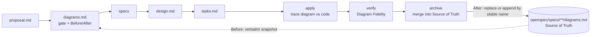

# VSDD Kit — Visual Spec-Driven Development for OpenSpec

**Architecture diagrams that stay true to the code.** VSDD extends
[OpenSpec](https://github.com/Fission-AI/OpenSpec) so that every change records a
**Before/After Mermaid diagram**, has it checked against the code, and on archive
**merges it into a canonical diagram Source of Truth**. Diagrams get the same delta
discipline as specs.

The kit is designed to be **installed by your AI coding agent**. Point Claude Code,
OpenCode, Qwen Code, Codex, Cursor or similar at [`SETUP.md`](SETUP.md), and it
installs, configures, seeds and verifies everything.

---

## Why

| Problem | What VSDD does |
|---|---|
| **Diagram drift**: diagrams are stale as soon as code changes | Diagrams change in the same change as the code, and merge on archive |
| Text specs hide structural impact | Reviewers see the Before and After states side by side |
| Agents forget architectural constraints over a long session | The agent must model the change visually before it writes requirements and tasks |
| No record of why the architecture changed | The archive keeps each Before/After pair plus a **Deviations** note (planned vs built) |

## How it works



1. **Gate.** Every change's `diagrams.md` starts with `## Diagram needed?`. Bug fixes
   are usually a one-line `NO`. The answer is `YES` when navigation, a state machine,
   data flow, topology or a schema changes.
2. **Before/After.** The Before state is copied **verbatim** from the Source of Truth.
   The After state proposes the change under the **same stable section names**.
3. **Diagrams checked against the code.** During apply and verify, the agent confirms
   that every node and edge in the After state exists in the code. Where they differ,
   it corrects the diagram and records the difference in a `## Deviations` section.
4. **Merge on archive.** Each After section replaces the section with the same name in
   `openspec/specs/<capability>/diagrams.md`, or is appended if the name is new.
   Nothing else in the file is touched.

A change's `diagrams.md`:

````markdown
## Diagram needed?

YES - adds a discount-code step to the checkout flow

## Before State

### Checkout Flow
<verbatim copy from the Source of Truth>

## After State

### Checkout Flow
<updated diagram>

### Discount Validation
<new diagram - appended on archive>

## Deviations
- **Proposed:** the app validates discount codes locally. **Built:** validation
  calls the pricing API. **Why:** discount rules change without an app release (design D2).
````

## Quick start

**Requirements:** [OpenSpec CLI](https://github.com/Fission-AI/OpenSpec) ≥ 1.2.0 and
Python ≥ 3.9. Optional: [mermaid-cli](https://github.com/mermaid-js/mermaid-cli) (`mmdc`),
for render checks.

```bash
npm install -g @fission-ai/openspec
git clone <this-repo> ~/vsdd-kit
```

Then open your project in your AI coding tool and say:

> Follow `~/vsdd-kit/SETUP.md` to install VSDD into this project.

The agent works through 10 steps (0 to 9). Each step ends with a verification
command. It only asks you about decisions that are yours: which AI tools you use,
config changes, CI, and removing existing rules. At the end it reports what it
installed.

| Step | What happens |
|---|---|
| 0 Preflight | Checks git, OpenSpec, Python and mmdc. Detects AI tools and any earlier or hand-edited install |
| 1 OpenSpec | `openspec init` / `update`, backing up hand-edited skills first |
| 2 Files | Installs the schema, docs and scripts |
| 3 Config | `openspec/config.yaml`, with `context` written from your actual project |
| 4 Agent files | Adds a routing section to `AGENTS.md` (and `CLAUDE.md` for Claude Code) |
| 5 Overlay | Adds the VSDD steps to the OpenSpec skills and wraps the `/opsx` commands |
| 6 Baseline | Seeds `openspec/specs/architecture/diagrams.md` from your real code |
| 7 CI | Optional GitHub Actions workflow |
| 8 Smoke test | Validates a sample change, breaks it on purpose, and cleans up |
| 9 Report | Summary, decisions made, and anything needing your attention |

## Day-to-day use

```text
/opsx:propose add offline caching to the file list   # proposal → diagrams → specs → design → tasks
#   review diagrams.md: gate, Before copied verbatim, After shows the intended change
/opsx:apply                                          # implement, then check the diagram against the code
/opsx:verify                                         # includes a Diagram Fidelity check
/opsx:archive                                        # syncs specs AND merges diagrams into the Source of Truth
```

Command names vary by tool (`/opsx:apply` in Claude Code, `/opsx-apply` in OpenCode
and Qwen).

```bash
python3 scripts/vsdd/validate_mermaid.py            # lint + change structure
python3 scripts/vsdd/validate_mermaid.py --render   # also render with mermaid-cli
python3 scripts/vsdd/install_overlay.py             # re-apply after `openspec update`
python3 scripts/vsdd/install_overlay.py --check     # CI: fail if the overlay was wiped
```

## What gets installed

| In your project | Purpose |
|---|---|
| `openspec/schemas/visual-driven/` | Schema and templates: `proposal → diagrams → specs → design → tasks` |
| `openspec/config.yaml` | `schema: visual-driven`, your project `context`, and per-artifact `rules` |
| `openspec/specs/**/diagrams.md` | The **Source of Truth**: one `## <Stable Name>` section per diagram |
| `docs/VSDD.md` | Standards for agents: gate, Before/After, Deviations, merge |
| `docs/MERMAID_RULES.md` | Syntax guardrails that keep LLM-written diagrams parseable |
| `AGENTS.md` section / `CLAUDE.md` | A short section that sends agents to the detailed docs only when they need them |
| `.<tool>/skills/openspec-*` | Stock OpenSpec skills with the VSDD steps inserted, each marked `<!-- vsdd:… -->` |
| `.<tool>/command*/opsx-*` | Thin wrappers that load those skills |
| `scripts/vsdd/` | `validate_mermaid.py`, `install_overlay.py` |
| `.github/workflows/vsdd.yml` | CI: render every diagram and check the overlay (optional) |

## Design notes

**Overlay, not forked skills.** `openspec init` and `openspec update` regenerate the
stock skills and commands for every tool and silently overwrite any edits.
`install_overlay.py` inserts marked VSDD blocks at stable anchor lines in whatever
skills OpenSpec generated, for any tool. Re-running it changes nothing that is already
in place, and `--check` reports whether it is applied.

**Commands become wrappers.** Stock `/opsx` commands carry their **own copy** of the
skill instructions. Without wrapping, typing `/opsx:archive` would skip the diagram
merge.

**Only `context:` and `rules:` are read.** OpenSpec 1.2.x reads only those two keys
from `config.yaml`, and ignores any other key (such as `prompts:`) without warning.
The example config and Step 3 of the runbook take care of this.

**The rule that matters most is also in the schema.** The rule that the diagram must
be checked against the code is in `schema.yaml` (`apply.instruction`), so the CLI
delivers it even if the overlay is missing.

**Mermaid guardrails.** LLMs often produce Mermaid that won't parse. The rules require
quoted node labels, explicit `activate`/`deactivate`, a declared flowchart direction
and no semicolons. Sequence-diagram participant names must **not** be quoted, because
the quotes show up in the rendered output. The validator enforces all of these, and
`--render` catches everything else.

## Keeping it working

| When | Do |
|---|---|
| After `openspec init` / `openspec update` | `python3 scripts/vsdd/install_overlay.py` |
| After upgrading OpenSpec | Run `tests/smoke_test.sh` in this repo. On `anchor not found`, update the anchors in `install_overlay.py` |
| When adding an AI tool | `openspec init --tools <tool>`, then the overlay |

> **Caution:** `openspec update` also **removes** skills for workflows missing from
> your global OpenSpec profile (`openspec config list`). Add every workflow you use
> with `openspec config profile` before updating.

## Testing the kit

```bash
tests/smoke_test.sh                 # tools: claude,opencode,qwen
TOOLS=claude tests/smoke_test.sh    # a single tool
KEEP=1 tests/smoke_test.sh          # keep the temp project for inspection
```

The test builds a throwaway project, runs the `SETUP.md` steps against your installed
OpenSpec, and checks 23 conditions:

- schema validity and `context`/`rules` injection
- overlay apply, idempotency and command wrapping
- diagram validation, including deliberately broken cases
- recovery after `openspec update`

## Repository layout

```
vsdd-kit/
├── README.md                    ← this file
├── SETUP.md                     ← runbook for the AI agent
├── docs/concept-report.md       ← background: the research and concept behind VSDD
├── tests/smoke_test.sh          ← end-to-end test
└── files/                       ← mirrors the target project layout
    ├── openspec/                ← schema, templates, config example, Source of Truth skeleton
    ├── docs/                    ← VSDD.md, MERMAID_RULES.md
    ├── agents/                  ← AGENTS.md section, CLAUDE.md example
    ├── scripts/vsdd/            ← install_overlay.py, validate_mermaid.py
    └── ci/github/vsdd.yml       ← GitHub Actions workflow
```

## Compatibility

Tested with OpenSpec **1.2.0**: stock skills for Claude Code, OpenCode and Qwen Code,
plus the custom-profile workflows continue, ff, new, bulk-archive and onboard.
Also tested with mermaid-cli 11.16.0 and Python 3. Other OpenSpec tools use the same
skill format and should work. If a stock skill's text differs, the overlay reports
`anchor not found` and does not insert anything at the wrong place.

## Limitations

- **Merges are carried out by the agent.** The archive merge is done by the agent
  following the archive skill, not by the OpenSpec CLI. Running `openspec archive`
  directly skips it.
- **Diagrams can't be deleted through the merge.** Remove sections from the Source of
  Truth by hand, as a task in the change.
- **Checking diagrams against the code is a best effort.** The agent searches for
  named symbols. It is not a static analyser.

## Background

[`docs/concept-report.md`](docs/concept-report.md) is the concept and research report
that motivated VSDD: diagram drift, diagram-first prompting, LLM Mermaid failure modes,
and a rollout plan for teams.
