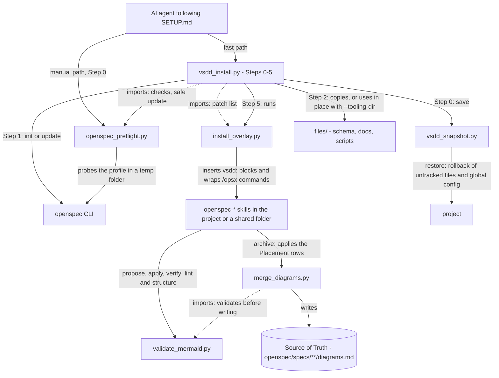

# How the kit fits together

A map for contributors: which script does what, and which ones call each other.
It is maintained by hand. When you add a script or change who calls whom, update the
diagram and the table in the same commit, then run
`python3 files/scripts/vsdd/validate_mermaid.py docs/ARCHITECTURE.md --render`.

## Kit Overview

Install time runs top to bottom. Solid edges are calls or file writes; dotted edges
are imports of shared code.

## Who does what

| Script | Job | Run by |
|---|---|---|
| `vsdd_install.py` | Steps 0–5 of the setup (by hand: `docs/SETUP-REFERENCE.md`) in one go, then records the kit version in `openspec/.vsdd.json`. Never makes an ASK decision: stops with exit 3 and names the flag. `--status` compares an install with the kit | The agent (fast path), or you. Runs from the kit, never copied into projects |
| `openspec_preflight.py` | Reports what `openspec update` would delete, tools to add, custom schemas, in-flight changes and shared workspace folders. `--safe-update` | The agent (manual path), the installer (imported), you before an `openspec update` |
| `install_overlay.py` | Inserts the marked VSDD blocks into the `openspec-*` skills, refreshes single-line ones, and turns `/opsx` commands into wrappers. `--check` for CI | The installer, and you after every `openspec init` / `update` |
| `validate_mermaid.py` | Mermaid lint, change structure (Placement, verbatim Before, ownership), decisions log. `--render` parses with mermaid-cli | The patched skills, CI, you |
| `merge_diagrams.py` | The archive merge: applies Placement rows (remove, move, update, add), refuses if the Source of Truth changed | The patched archive skill |
| `vsdd_snapshot.py` | Saves and restores what git can't: untracked install files and the global OpenSpec config | The installer (save), you (restore) |

## Where the pieces end up

- **In the project:** the `visual-driven` schema (OpenSpec only looks there), the
  `config.yaml` entries, the diagrams and the decisions log. Also the docs and scripts,
  unless `--tooling-dir` puts them elsewhere.
- **In the tool folders** (the project's, or a shared workspace folder): the patched
  skills and the command wrappers.
- **Outside both:** snapshots in `~/.vsdd-snapshots/`.

## Invariants worth keeping

- The overlay only adds marked blocks (`<!-- vsdd:<id> -->`, and for multi-line blocks
  a closing `<!-- /vsdd:<id> -->`), so re-running it is safe, a kit upgrade replaces
  each block whole, and `--check` can tell a wiped or stale skill from a patched one.
  Never change a block's `<id>`: that is how an upgrade finds it.
- The kit version lives in `VERSION`. Bump it when a change alters what gets
  installed, so `--status` reports existing installs as behind.
- Scripts that write (`merge_diagrams.py`, the installer) validate or inspect first,
  and change nothing when they refuse.
- Every behaviour above has a check in `tests/smoke_test.sh`. A change to a script
  without a matching check is incomplete.
