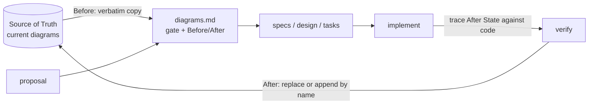

# The Case for Visual Spec-Driven Development

**Summary:** AI agents now write much of the code in many teams. Code gets written
quickly, but understanding of it doesn't keep up. Specs capture intent in text, yet
the structure of a system (what calls what, which states exist, where data flows) is
still something people hold in their heads, or in diagrams nobody trusts. VSDD makes
that structure part of every change. The agent must **draw the change before it
builds it**, the diagram is **checked against the code** afterwards, and the canonical
diagram is **updated on archive**. The cost is a few minutes of review per structural
change and some extra tokens. In return you get architecture documentation that stays
current, an early warning when a design doesn't hold together, and a record of why
the system is shaped the way it is.

This document makes that argument, including the objections. It is meant for the
engineers and leads deciding whether to adopt VSDD.

---

## 1. The problem

### 1.1 Architecture diagrams go stale

Every team has drawn an architecture diagram. Few trust theirs. A diagram drawn in a
design tool is correct on the day it's drawn. From then on, nothing links it to the
code, so each merged change that touches structure makes it a little more wrong,
without anyone noticing. After a few months people stop looking at it. Then they stop
updating it. Then new starters are told to "just read the code".

This is not a discipline problem. It's a tooling problem. Keeping the diagram current
takes extra effort, the reward comes later, and nothing flags when it has fallen
behind. A process built like that will always drift.

### 1.2 AI agents make it worse

AI coding agents change the economics:

- **More structural change, faster.** An agent can refactor across ten files in
  minutes. The structure changes faster than any diagram maintained by hand can
  follow.
- **Less shared understanding.** When a person writes the code, the understanding
  lives in their head. When an agent writes it and a person skims the diff, that
  understanding may exist nowhere.
- **Intent drift.** Over a long session, agents lose track of constraints stated at the
  start. By the twentieth prompt, the layering rule from the first one is often gone.
- **Line-by-line review doesn't show structure.** A 600-line diff shows *what* changed
  on each line, not what happened to the architecture. Reviewers approve changes
  whose structural impact they never saw.

### 1.3 Text specs help, but only in text

Spec-driven development (OpenSpec, Spec Kit and similar tools) is a real improvement.
Intent is written down, changes are deltas against a living spec, and the agent works
from a contract rather than a chat history. But requirements written as
`WHEN … THEN …` scenarios describe **behaviour**, not **structure**. Two
implementations can satisfy the same scenarios with completely different
architectures. A spec won't tell a reviewer that a change routes a call around the
domain layer, adds a state that the UI never handles, or makes a package depend on
one it shouldn't.

---

## 2. The proposal

VSDD adds a **diagrams** step to the OpenSpec change pipeline, and holds diagrams to
the same rules as specs:

1. **Gate.** Each change decides whether it has a structural impact. Most bug fixes
   don't, and they record `NO` in one line and move on.
2. **Draw the change first.** If it does, the agent copies the affected diagrams
   **verbatim** (Before), and proposes the new structure under the same names (After),
   *before* writing detailed requirements or code.
3. **Check it against the code.** After implementation, every participant and edge in
   the After State must exist in the code. Where the build differs from the plan, the
   diagram is corrected and a **Deviations** note records what changed and why.
4. **Merge on archive.** The After State replaces the matching sections of the
   canonical diagrams. The Before/After pair and the Deviations note stay in the
   archive as history.
5. **Keep the lesson.** When a fix reveals a pattern that could recur, the archive
   step proposes a one-rule entry for a decisions log, which later designs read first.

The kit makes this practical: a one-shot installer (the agent does only the judgement
steps), a skill overlay that survives OpenSpec upgrades, and a validator that keeps
LLM-written Mermaid parseable and diagrams in the capability they describe.

---

## 3. The benefits

### 3.1 Diagrams that stay true to the code

This is the headline benefit. Diagrams are updated **in the same change** as the code,
by the same agent, and checked against the code before archive. There is no separate
"update the docs" task to forget. The canonical diagram is only as old as the last
change that touched that part of the system.

Merging by section name keeps this cheap: a change only touches the diagrams it
names, so the Source of Truth is never regenerated wholesale, and unrelated
sections are never rewritten.

### 3.2 Structural review before code exists

The `diagrams.md` review is the most valuable five minutes in the process. A reviewer
comparing Before and After can see at a glance:

- a call that skips a layer
- a new dependency pointing the wrong way
- a state with no path out of it, or a state the UI doesn't handle
- a flow that is far more complicated than the problem needs

Catching these in a diagram costs a sentence of feedback. Catching them in a pull
request costs a rewrite. Catching them in production costs more still.

### 3.3 Diagrams keep the agent on track

Before it can write requirements and tasks, the agent must commit to a concrete
structure: named participants, explicit states, directed edges. That commitment then
acts as a contract for the rest of the change, which counters intent drift. And if
the agent **can't** produce a coherent diagram, that is a useful signal in itself: the
design isn't understood yet, and code generated from it would probably be muddled
too.

The concept report behind this kit
([docs/concept-report.md](concept-report.md)) cites research on structure-guided code
generation (StructGen) reporting accuracy gains of **9.4%–37.3%** when diagrams guide
LLM code generation. We haven't reproduced these figures, and your gains will depend
on your codebase and model. Treat them as a reason to try VSDD, not as a promise.

### 3.4 A record of why the architecture changed

Git history shows *what* changed. The VSDD archive shows **how the architecture
looked before, how it looks after, and why the build differed from the plan**. A year
from now, "why does status go through this path?" has an answer: the archived change
that introduced it, with its diagrams and its Deviations note.

Deviations notes are the underrated part. Most documentation records the plan. VSDD
records **the plan, what was actually built, and the constraint that forced the
difference**. That is the knowledge that usually leaves the team when someone does.

### 3.5 Lessons that outlive the fix

Specs record what each capability does. They don't record the general lesson behind a
fix. So an agent building the next feature in another capability repeats the mistake
the team fixed last month, because nothing it reads mentions it. In a VSDD test run,
exactly that happened: a list-refresh bug fixed for one action reappeared, line for
line, in the next feature that wrote data.

The decisions log is VSDD's answer. It's a short file of rules, each with the reason
and the change it came from. The archive step proposes an entry when a fix reveals a
pattern that could recur, and asks before adding it. The design step reads the log
first, and a design that breaks a rule has to say so. It turns "we learned this the
hard way" into something the next agent session actually sees.

### 3.6 Faster onboarding

A new engineer, human or AI, can read the current structure in the
Source of Truth diagrams in minutes, and trust that it matches the code. The same
diagrams give agents a compact, accurate picture of the architecture at the start of
a session, which costs far fewer tokens than reading the source.

---

## 4. The costs, stated honestly

| Cost | Size | How it's contained |
|---|---|---|
| **Review time** | A few minutes per YES-gated change | Most changes are NO-gated in one line. Review time goes only where structure changes |
| **Tokens** | Reading the relevant Source of Truth sections and writing Before/After | Only *affected* sections are copied. Agents load the detailed rules only when they are drawing diagrams |
| **LLM Mermaid errors** | LLMs often produce Mermaid that won't parse, especially large diagrams | `MERMAID_RULES.md` restricts diagrams to syntax LLMs handle reliably, and the validator (plus `--render` in CI) catches the rest |
| **Process discipline** | A hotfix that bypasses `/opsx` leaves the diagrams stale | The diagrams are checked against the code at the next change that touches that area, and drift appears as a Deviations note or a Diagram Fidelity warning |
| **Tool maintenance** | `openspec update` wipes customisations | The overlay re-applies in one command, and `install_overlay.py --check` in CI catches a forgotten run |
| **Decisions log upkeep** | A stale rule misleads as much as a missing one | Entries are short and name their source change, so a reviewer can judge whether one still applies. The archive step asks before adding or retiring one |
| **Baseline effort** | Each area of the system needs an initial diagram before its first delta | The installer seeds the cross-cutting diagrams from the code. Other areas get theirs the first time a change touches them |

The honest summary: VSDD adds friction **only** where structure changes, and structure
changes are exactly where a little friction pays for itself.

---

## 5. Objections and responses

**"We already have specs. Isn't this duplication?"**
Specs describe behaviour, diagrams describe structure, and neither can stand in for
the other (§1.3). In VSDD they reinforce each other: requirements are written *after*
the diagrams, against the structure they describe.

**"Diagrams slow us down."**
Only YES-gated changes need one, and the agent draws it. What people add is the
review, and that review replaces work that is slower and happens later: untangling a
structural mistake in code review or after release.

**"The agent will just draw what it's going to build anyway."**
Partly true, and still useful: it makes the plan visible *before* the build, when
changing it costs nothing. And checking the diagram against the code afterwards
closes the loop. The final diagram has to match what was built, not what was
promised.

**"Our diagrams will still drift. Someone will skip the process."**
Some will. But drift under VSDD is caught. The next change that touches that area
compares its Before State with the code, and any mismatch shows up. Compare that
with the status quo, where drift is never detected at all.

**"LLMs are bad at diagrams."**
They are bad at *large, unconstrained* diagrams. VSDD asks for small diagrams with one
concern each, in a constrained Mermaid subset, validated automatically. A focused
sequence diagram of one flow is well within what current models do reliably.

**"Why Mermaid, not a proper modelling tool?"**
Because Mermaid is text. It diffs, merges, lives next to the specs, renders on GitHub
and in IDEs, and agents can read and write it. A modelling tool's files can't go
through the change pipeline, and that pipeline is the whole point.

**"What if OpenSpec changes or goes away?"**
The valuable output is plain Markdown and Mermaid in your repository: the Source of
Truth diagrams and the archive. Those stay readable and useful without any tool.

---

## 6. When VSDD fits, and when it doesn't

**A strong fit:**
- Codebases with real layering: clean architecture, modular monorepos, services
  with clear boundaries
- Teams where AI agents write a large share of the code
- Stateful clients (state machines in Cubit, BLoC, Redux, XState and similar) and
  systems with non-trivial flows or infrastructure
- Teams with turnover, or that onboard often

**A weak fit:**
- Throwaway prototypes and spikes
- Tiny codebases one person holds entirely in their head
- Work that is almost all content, styling or configuration, which would be NO-gated
  every time anyway

**Prerequisite:** VSDD builds on OpenSpec. If the team won't adopt spec-driven
changes, adopt that first. VSDD adds little on its own.

---

## 7. How to adopt it

Adopt it in stages rather than switching everyone over at once:

| Phase | What | Exit criterion |
|---|---|---|
| **1. Trial** (a few days) | Install into a scratch app, and walk one YES and one NO change through the full cycle | The team has seen a Before/After review and a merge on archive |
| **2. Baseline** (a week) | Install into the real repo. Seed the cross-cutting diagrams from the code and review them | The seeded diagrams match the code (spot-checked by grepping for names) |
| **3. Pilot** (2–4 weeks) | One team or area uses VSDD for all its changes | The measures below are collected |
| **4. Rollout** | All changes go through `/opsx`. CI runs the validator and the overlay check | CI is green, and diagram review is part of normal change review |

---

## 8. How to tell whether it's working

Measure a few things during the pilot, rather than debating in the abstract:

| Measure | How | Healthy sign |
|---|---|---|
| **Diagram currency** | Pick 5 Source of Truth diagrams at random and trace them against the code | All 5 match |
| **Structural issues caught early** | Count review comments on `diagrams.md` that changed the design | More than zero. Each one is a problem found before the code existed |
| **Share of YES gates** | YES gates as a share of all archived changes | No fixed target. As a starting heuristic, expect a minority of changes, perhaps 20–40%. Nearly all YES suggests the gate is too strict, and nearly all NO suggests it's being dodged. Calibrate for your codebase |
| **Deviations recorded** | Archived YES changes that have a Deviations note | Some, not all. None at all suggests the check against the code isn't really happening |
| **Repeated mistakes** | Bugs whose cause was fixed before, in another place | Rare, and each one gets a decisions entry. A repeat despite an entry means the log isn't reaching the design step |
| **Review cost** | Time to review `diagrams.md` | A few minutes. More than 15 suggests the diagrams are too big, so split them |
| **Onboarding** | Ask a new engineer or a fresh agent session to explain one area, using only the diagrams | Their explanation matches the code |

If after the pilot the diagrams aren't current, review isn't catching anything, and
the team resents the step, stop. Keep whatever diagrams you have. They're plain
Markdown.

---

## 9. The bottom line

Much of the code is now written by agents that forget, and reviewed by people who
can't see structure in a diff. In that setting, knowing the shape of your system
is a property that can quietly degrade. VSDD protects it cheaply. Every structural
change must show its shape before it's built, prove its shape after it's built,
and leave the canonical picture more accurate than it found it.

Try it on a scratch app for an afternoon (see the [README](../README.md) quick start).
The first Before/After review usually makes the case better than this document can.
