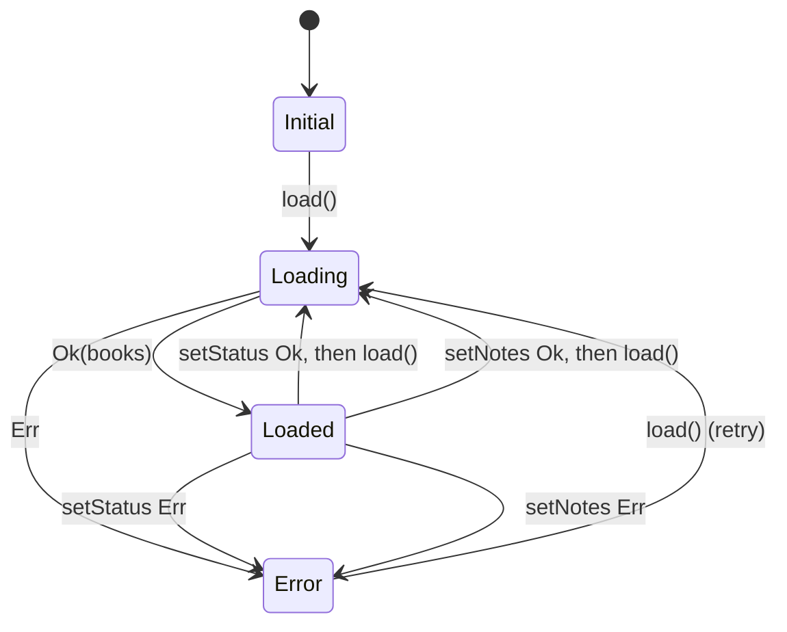
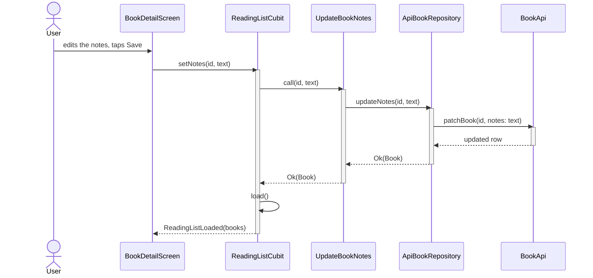

# Worked example: adding book notes

A real VSDD change, run end to end with kit 0.2.0 and OpenSpec 1.13.2 on
vsdd-testdrive, a small Flutter reading-list app (flutter_bloc and go_router, with a
fake in-memory API). Every file here is copied unedited from that run.

**The request:** *let readers keep private notes on a book, editable on the detail
screen.* This is the change the testdrive's own walkthrough uses, including its
scripted mid-apply redirect (step 3 below).

| File | What it is |
|---|---|
| [`specs-before/`](specs-before) | The Source of Truth before the change: three diagrams drawn from the code at install, and the decisions log |
| [`diagrams.proposed.md`](diagrams.proposed.md) | The change's `diagrams.md` as proposed, before any code was written |
| [`change/`](change) | The archived change: [`proposal.md`](change/proposal.md), [`diagrams.md`](change/diagrams.md) as built, [`specs/`](change/specs/book-notes/spec.md), [`design.md`](change/design.md), [`tasks.md`](change/tasks.md) |
| [`code.diff`](code.diff) | The implementation (`lib/` and `test/`): `flutter analyze` clean, 8 tests passing |
| [`specs-after/`](specs-after) | The Source of Truth after the archive merge, plus the new `book-notes/spec.md` |

## 1. Propose: the diagrams come before the requirements

The schema orders the artifacts `proposal → diagrams → specs → design → tasks`, so
the structural picture is settled before anyone writes requirements. The proposed
[`diagrams.md`](diagrams.proposed.md) starts with the gate and the Placement table:

```markdown
## Diagram needed?

YES - adds a notes update path through data, domain and presentation, and new
transitions to the ReadingListCubit state machine.

## Placement

| Stable name | Source of Truth file | Action | Why here |
|---|---|---|---|
| ReadingListState Machine | specs/architecture/diagrams.md | update | |
| Notes Update Flow | specs/book-notes/diagrams.md | add | |
```

What a reviewer checks here:

- **Ownership.** The new flow shows one capability, so it goes in that capability's
  own file, `specs/book-notes/diagrams.md`, and not in the shared architecture file.
  The state machine stays in the architecture file, because the Cubit serves both
  reading status and notes.
- **The Before State is a verbatim copy** of `ReadingListState Machine` from
  [`specs-before`](specs-before/architecture/diagrams.md). The validator checks this,
  and the archive refuses to merge if the Source of Truth has changed since.
- **The After State keeps the stable name**, and adds two transitions:



## 2. Apply: build it

The tasks were worked through in order: the `notes` field, an `UpdateBookNotes` use
case, the repository and API calls, `ReadingListCubit.setNotes`, and a notes field
with a Save button on the detail screen. See [`code.diff`](code.diff).

## 3. The diagram is checked against the code, and corrected

Part-way through, a reviewer asked for one generic `BookApi.patchBook(id, changes)`
instead of a new `patchNotes` next to `patchStatus` (the walkthrough's scripted
redirect). That made the code differ from the proposal. Before the change counts as
done, the apply step traces every participant and call in the After State to the
code. That trace found two mismatches:

1. `Notes Update Flow` still called `patchNotes`, which no longer exists.
2. `Status Update Flow`, in the Source of Truth but not part of the change, called
   `patchStatus`, which the redirect had also replaced.

Both were fixed in the change's [`diagrams.md`](change/diagrams.md): a new Placement
row for `Status Update Flow` (with its verbatim Before copy), `patchBook` in both
flows, and a Deviations note. Deviations are kept with the change and never merged:

```markdown
## Deviations

- **Proposed:** `BookApi.patchNotes(id, text)`, next to `patchStatus` (design D3).
  **Built:** one `BookApi.patchBook(id, changes)`, used for notes and status alike.
  `ApiBookRepository.updateStatus` now calls `patchBook(id, {'status': ...})`, so the
  Status Update Flow changed too, and got a Placement row.
  **Why:** a reviewer asked for one PATCH path for all book fields during apply
  (the redirect in the testdrive walkthrough, §5.5): it avoids a second copy of the
  latency, lookup and 404 handling.
```

Without this step, the archive would have merged a diagram of a `patchNotes` call
that doesn't exist, and left `Status Update Flow` showing the old `patchStatus`.

## 4. Archive: the Source of Truth catches up

`merge_diagrams.py` applied the Placement rows, previewing them first with
`--dry-run`:

```text
replaced: ReadingListState Machine in specs/architecture/diagrams.md
replaced: Status Update Flow in specs/architecture/diagrams.md
added (appended): Notes Update Flow to specs/book-notes/diagrams.md
Diagrams: merged 3 placement row(s).
```

Then `openspec archive` synced the requirements into `specs/book-notes/spec.md`.

The whole diff of the architecture file is the merged sections. `Module Hierarchy`
had no Placement row, so it wasn't touched:

```diff
-API and back, including the full list reload after a successful write.
+API and back, including the full list reload after a successful write. The API
+call is the generic `patchBook`, shared with notes.
 ...
-    R->>A: patchStatus(id, status)
+    R->>A: patchBook(id, status: name)
 ...
-State transitions of ReadingListCubit.
+State transitions of ReadingListCubit. Saving notes reloads the list, like a status change.
 ...
+    Loaded --> Loading: setNotes Ok, then load()
+    Loaded --> Error: setNotes Err
```

The new capability owns its flow, next to its spec, in
[`specs-after/book-notes/diagrams.md`](specs-after/book-notes/diagrams.md):



**Decisions log: unchanged.** The archive step asks whether the change teaches a
rule that other changes must follow. Adding a field doesn't. `patchBook` is a
convention, but it is visible in the code and now in two diagrams, and there is no
past mistake for a rule to guard against.

## What this shows

- **Reviewers saw the structural impact before any code:** two diagrams, where they
  live, and exactly what changes in each.
- **The diagrams describe what was built, not what was planned.** The redirect
  changed a flow the proposal never mentioned, and the check against the code caught
  it.
- **The history is kept.** The archived change holds the Before/After pairs and the
  reason for the deviation. The Source of Truth holds only the current state.

## Kept honest by the kit's tests

`tests/smoke_test.sh` replays this archive against `specs-before/` with the current
`merge_diagrams.py`, and checks that the result matches `specs-after/` byte for byte.
If a kit change alters how merges behave, the example fails.
