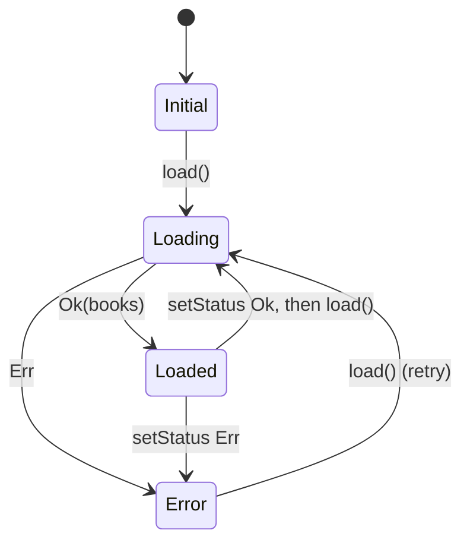
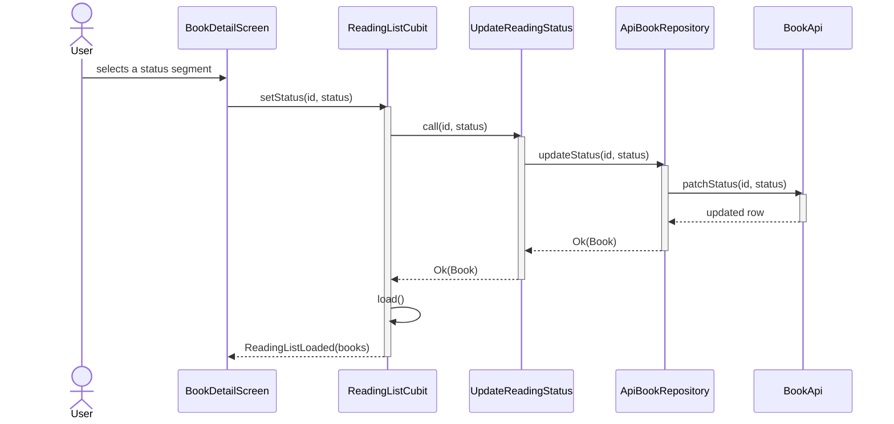
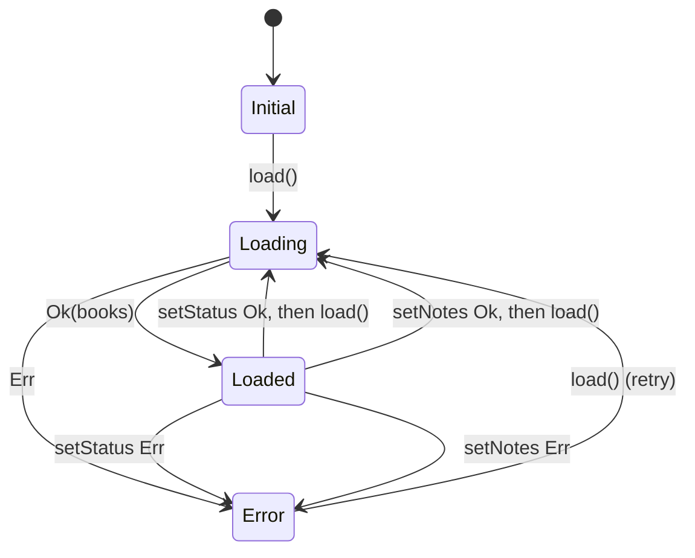
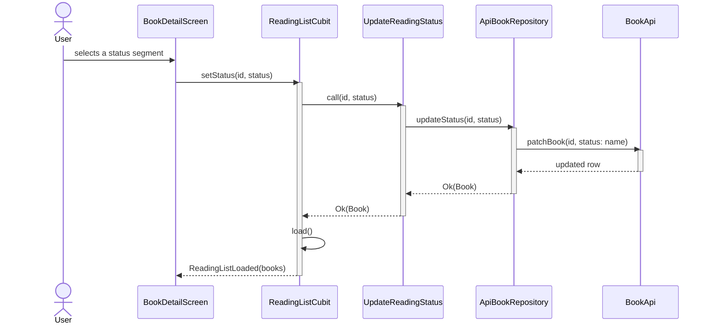
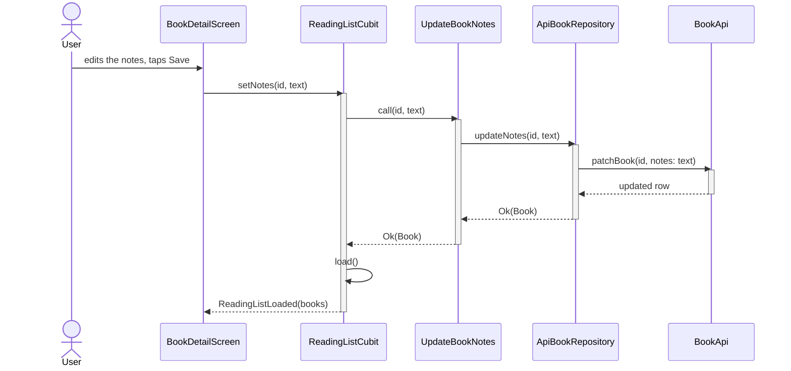

## Diagram needed?

YES - adds a notes update path through data, domain and presentation, and new
transitions to the ReadingListCubit state machine.

## Placement

| Stable name | Source of Truth file | Action | Why here |
|---|---|---|---|
| ReadingListState Machine | specs/architecture/diagrams.md | update | |
| Status Update Flow | specs/architecture/diagrams.md | update | |
| Notes Update Flow | specs/book-notes/diagrams.md | add | |

## Before State

### ReadingListState Machine
State transitions of ReadingListCubit.

### Status Update Flow
How changing a book's reading status travels from the detail screen to the fake
API and back, including the full list reload after a successful write.

## After State

### ReadingListState Machine
State transitions of ReadingListCubit. Saving notes reloads the list, like a status change.

### Status Update Flow
How changing a book's reading status travels from the detail screen to the fake
API and back, including the full list reload after a successful write. The API
call is the generic `patchBook`, shared with notes.

### Notes Update Flow
Saving a book's notes from the detail screen, through to the fake API, then the list reload.

## Deviations

- **Proposed:** `BookApi.patchNotes(id, text)`, next to `patchStatus` (design D3).
  **Built:** one `BookApi.patchBook(id, changes)`, used for notes and status alike.
  `ApiBookRepository.updateStatus` now calls `patchBook(id, {'status': ...})`, so the
  Status Update Flow changed too, and got a Placement row.
  **Why:** a reviewer asked for one PATCH path for all book fields during apply
  (the redirect in the testdrive walkthrough, §5.5): it avoids a second copy of the
  latency, lookup and 404 handling.
