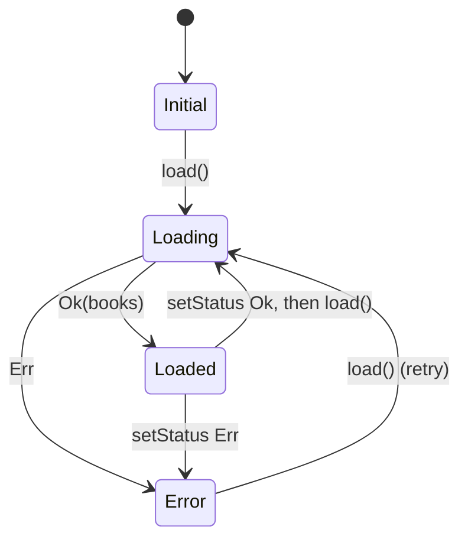
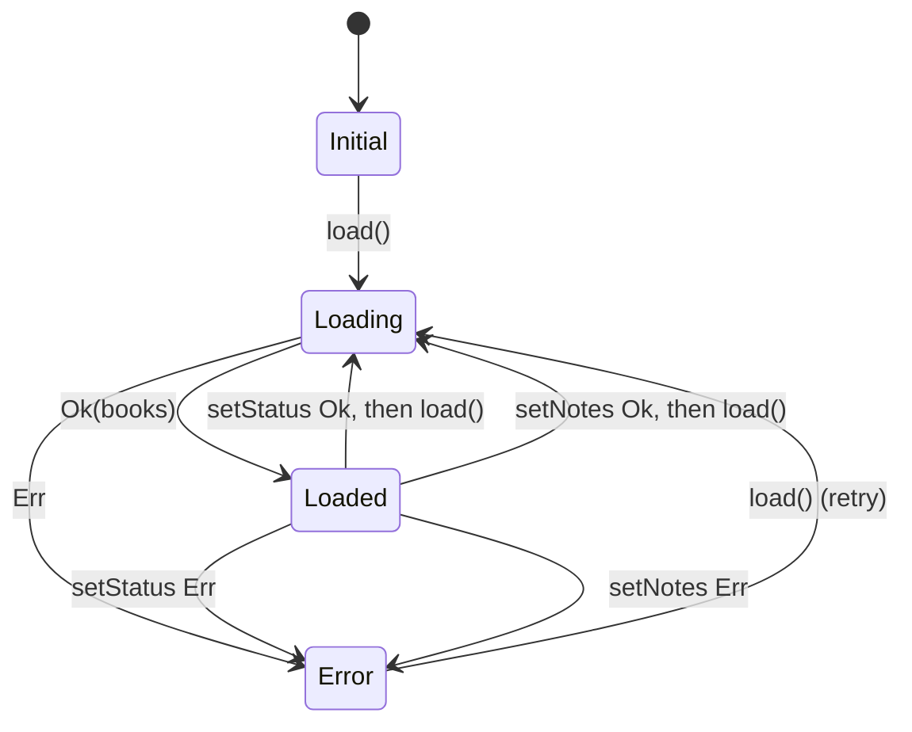
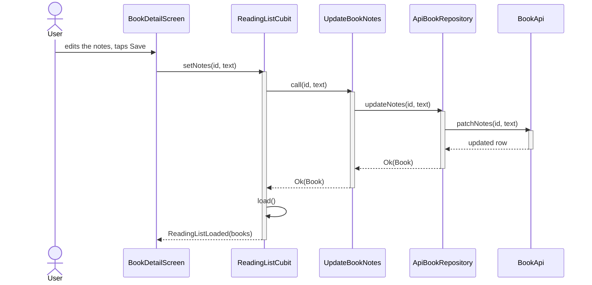

## Diagram needed?

YES - adds a notes update path through data, domain and presentation, and new
transitions to the ReadingListCubit state machine.

## Placement

| Stable name | Source of Truth file | Action | Why here |
|---|---|---|---|
| ReadingListState Machine | specs/architecture/diagrams.md | update | |
| Notes Update Flow | specs/book-notes/diagrams.md | add | |

## Before State

### ReadingListState Machine
State transitions of ReadingListCubit.

## After State

### ReadingListState Machine
State transitions of ReadingListCubit. Saving notes reloads the list, like a status change.

### Notes Update Flow
Saving a book's notes from the detail screen, through to the fake API, then the list reload.

