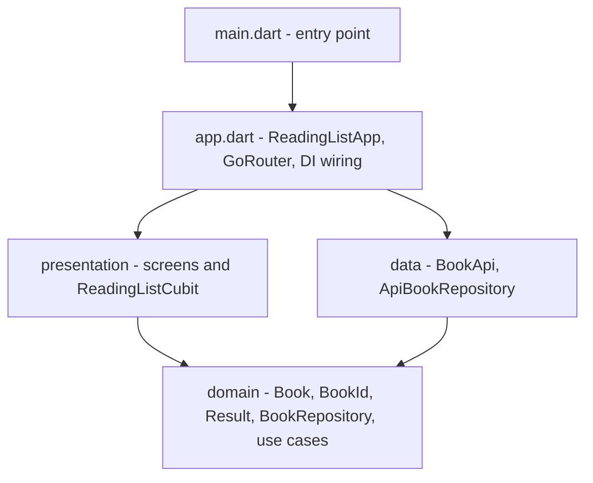
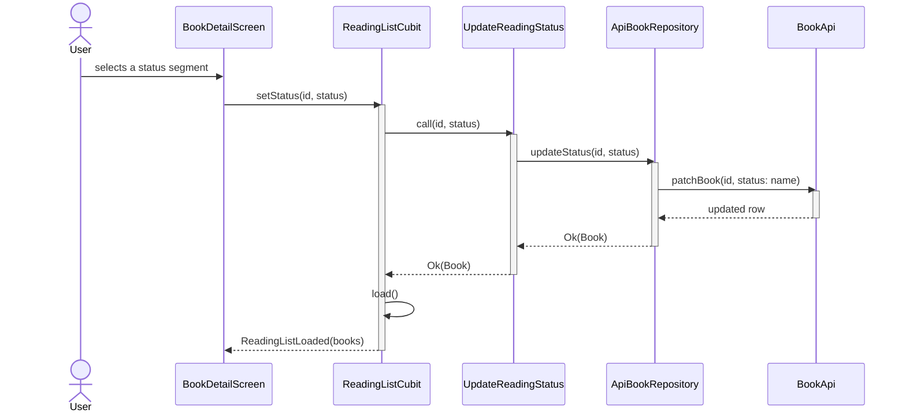
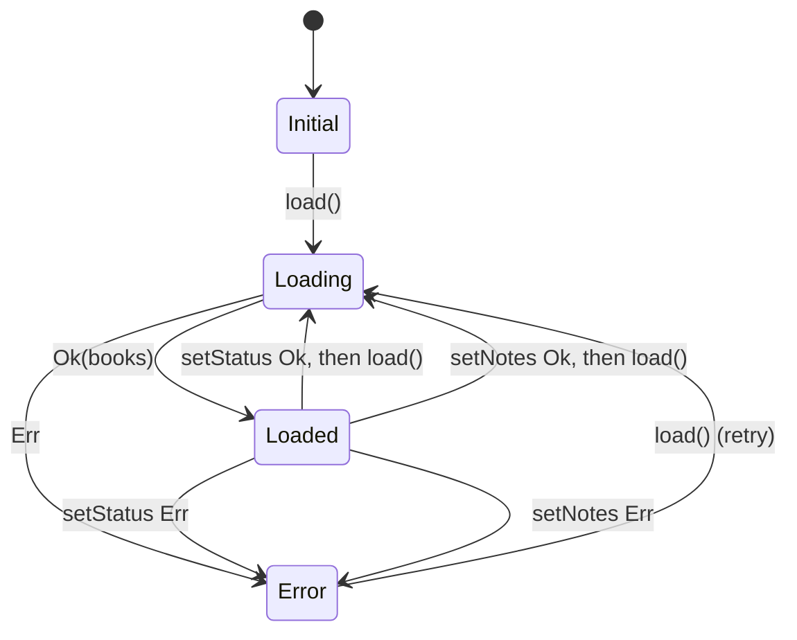

# Architecture Diagrams

Cross-cutting, system-wide diagrams for vsdd_testdrive. Each `## <Stable Name>`
section is a merge target for archived OpenSpec changes. Keep the names stable.

## Module Hierarchy

Dependency direction between the application's top-level modules. Arrows point
from the dependent module to its dependency.

## Status Update Flow

How changing a book's reading status travels from the detail screen to the fake
API and back, including the full list reload after a successful write. The API
call is the generic `patchBook`, shared with notes.

## ReadingListState Machine

State transitions of ReadingListCubit. Saving notes reloads the list, like a status change.

