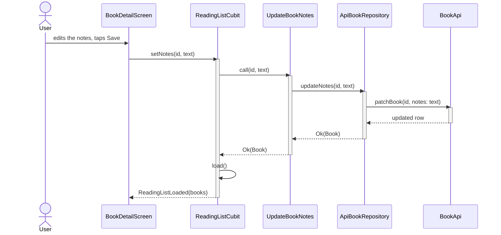

# Book Notes Diagrams

## Notes Update Flow

Saving a book's notes from the detail screen, through to the fake API, then the list reload.

```mermaid
sequenceDiagram
    actor U as User
    participant D as BookDetailScreen
    participant C as ReadingListCubit
    participant UC as UpdateBookNotes
    participant R as ApiBookRepository
    participant A as BookApi
    U->>D: edits the notes, taps Save
    D->>C: setNotes(id, text)
    activate C
    C->>UC: call(id, text)
    activate UC
    UC->>R: updateNotes(id, text)
    activate R
    R->>A: patchBook(id, notes: text)
    activate A
    A-->>R: updated row
    deactivate A
    R-->>UC: Ok(Book)
    deactivate R
    UC-->>C: Ok(Book)
    deactivate UC
    C->>C: load()
    C-->>D: ReadingListLoaded(books)
    deactivate C
```
