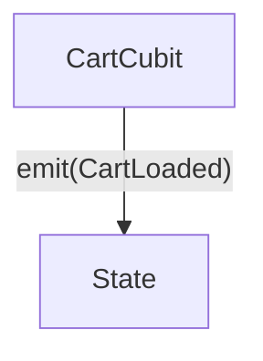
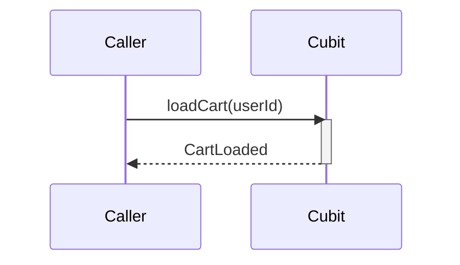
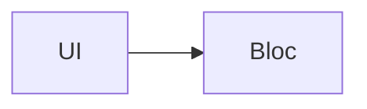
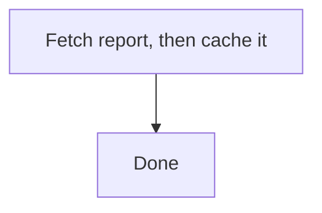
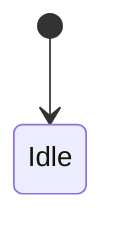

# Mermaid Rules

Syntax guardrails for every Mermaid diagram in this repo. Read this file **before
drafting any diagram** (Source of Truth `diagrams.md`, change `diagrams.md`, or
diagrams embedded in proposals/designs).

## 1. Quoted labels

Quote every node label, edge label, and message that contains spaces or special
characters. Unquoted labels break on the first `(`, `)`, `#`, or space.

**Exception:** sequence-diagram participant aliases (`participant C as Cart Cubit`)
are NOT quoted. Quotes there render literally. Messages after `:` need no quotes either.



## 2. Explicit activation in sequence diagrams

Use explicit `activate` / `deactivate` statements. Do **not** use the `+` / `-`
shorthand on arrows.



## 3. Mandatory flowchart direction

Every `flowchart` MUST declare a layout direction on the first line
(`TD`, `BT`, `LR`, or `RL`).



## 4. No semicolons

Mermaid treats `;` as a statement separator. Never put a semicolon in a label,
message, or note. Replace it with a comma, dash, or period.



## 5. Diagram type by concern

| Concern | Diagram type |
|---------|--------------|
| Navigation / routing flow | `sequenceDiagram` |
| State machines (BLoC/Cubit, Redux, XState, workflow states) | `stateDiagram-v2` |
| Infrastructure / system topology | `flowchart` |
| Data schema | `erDiagram` |

## 6. Stable section names (Source of Truth convention)

A Source of Truth `diagrams.md` holds one `## <Stable Name>` section per diagram:
a one-line description, then a ` ```mermaid ` block.

```markdown
## CartState Machine
State transitions of CartCubit.


```

Rules:

- Stable names are the merge key. When a change modifies an existing diagram,
  keep the section name unchanged so the archive merge can target it.
- New diagrams get a new stable name (PascalCase or kebab-case, no spaces
  required but allowed).
- A change's `diagrams.md` snapshots affected sections under `## Before State`
  and proposes them under `## After State`, using the same stable names as
  `### <Stable Name>` subsections.

## 7. Size and readability

- Keep each diagram readable on a 14–16" display without zooming out.
- If a diagram grows too complex, split it into smaller focused diagrams
  (one per concern) rather than one giant diagram.
